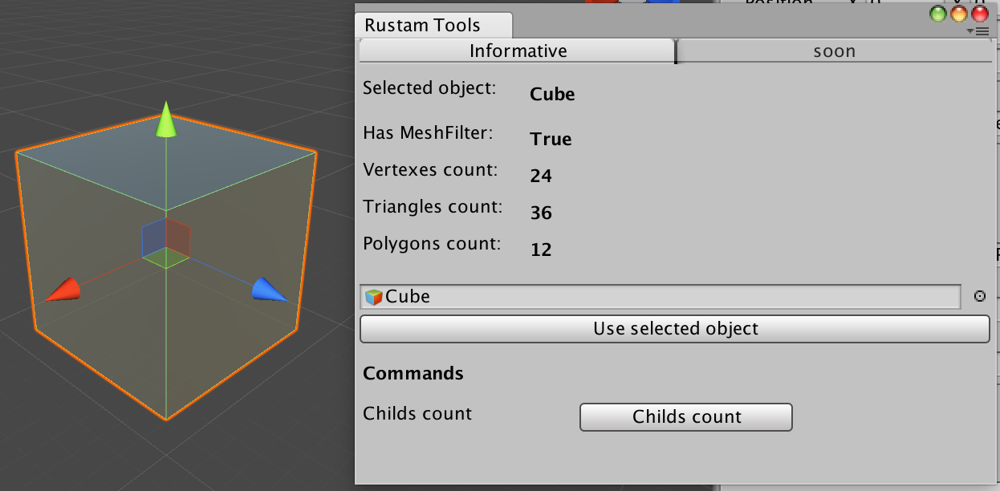

# HelperTools-Unity
## Set of different helper tools for Unity3D.

Utils window

Mesh information script

## You can

1) Check if selected object has `MeshFilter` component.
2) Calculate `vertex` count for the object
3) Calculate `triangles` count for the object
4) Calculate `polygons` count for the object (polygons = triangles / 3)
5) Calculate total amount of `child` objects
6) Add `MeshInformation` script to the object to see its mesh information.

## Installation

### Unity Asset Store.
> soon

### Download unitypackage

- Goto `Unitypackages` folder and download appropriate unitypackage.
- Then double click on it or drag it directly to your Unity3D scene

## Usage
Just use new menu `Rustam Tools`.

## Contributing

Please, do as much PRs as possible. 🐈

## License

Under MIT license.

## Updates

`0.0.4`

* Added `MeshInformation` script.
* Made some improvements. 
